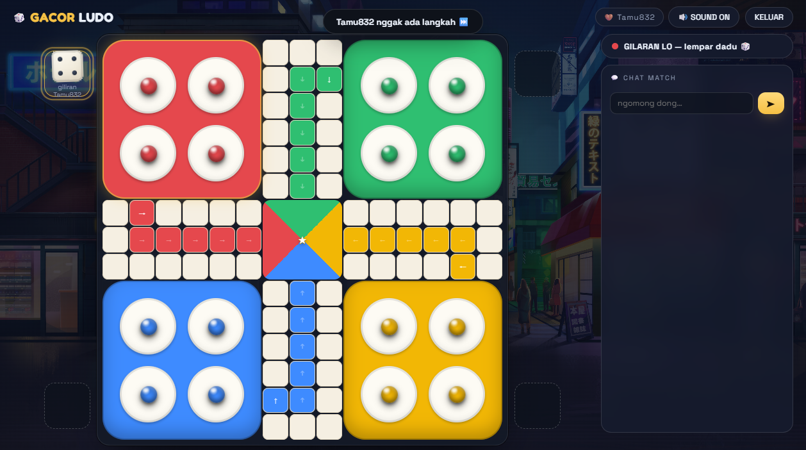

# 🎲 GACOR LUDO

Game **Ludo online 4 pemain** rasa gacor — vanilla HTML/CSS/JS, tanpa framework, tanpa build.



## 🎮 Fitur

- **4 mode main**: lawan bot (3 level: gaampang/sedang/susah), room online via kode, join room
- **Online P2P** — PeerJS, host authoritatif, AFK/disconnect auto bot gantian
- **Dadu 3D** nempel di slot pemain yang giliran — pindah otomatis tiap giliran, **pencet dadu buat lempar**
- **Auth + Remember Me** — login/daftar/tamu, auto-login pas balik buka
- **Role admin** — user `WALKOER` auto-admin, dashboard admin lengkap (user + password, chat, riwayat, presence online)
- **Chat** — global di lobby + per-match (clear tiap match baru)
- **Playlist BGM 15 lagu** — ganti lagu otomatis pas habis, shuffle tiap sesi
- **Aturan lengkap**: keluar base butuh 6, makan token balik markas, petak aman ★, block 2 token, 3x enam hangus

## 🚀 Cara main

Buka `public/index.html` di browser. Selesai.

Atau main online: host klik **BUAT ROOM** → share kode 5 huruf → temen klik **JOIN ROOM**.

## 🗂️ Struktur

```
├── public/          index.html + admin.html (dashboard, kode: GACOR-ADMIN)
├── css/             style.css
├── js/              game.js net.js ui.js main.js db.js admin.js
└── assets/
    ├── audio/       15 track BGM (playlist)
    └── img/         background + preview
```

## 🔧 Teknologi

Vanilla JS, localStorage database, PeerJS untuk online, WebAudio, CSS grid/flex — responsive mobile ready.

---

© 2026 WALKOER • KUDUS 🔥
